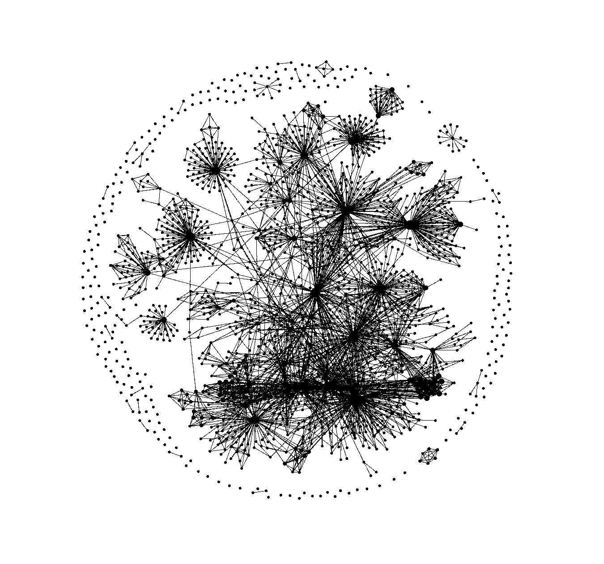

# Introduction

Cet article n'engage que moi et a pour objectif de vous exposer sous le prisme de ma propre expérience les pratiques que
je juge être pertinentes lors de l'initiation d'un projet. Bien que non exhaustif, je tente d'énumérer via cet article
de nombreux aspects liés à la structure d'un projet pour minimiser la nécessité de choisir entre la rapidité d'exécution
et la qualité du livrable.

Ce billet de blog appartient à un ensemble d'articles `$ project init` qui sera publié au fil de l'eau, dans l'ordre d'
imbrication des chapitres, le premier étant: **LA DOCUMENTATION** à retrouver
sur [https://clement-dev.netlify.app/](https://clement-dev.netlify.app/)

# La Documentation

Je suis conscient que ce sujet fait débat, notamment au sein de la communauté agile, il suffit de ressortir cet article
d'Uncle Bob pour s'en
convaincre: [http://www.butunclebob.com/ArticleS.UncleBob.OnDocumentation](http://www.butunclebob.com/ArticleS.UncleBob.OnDocumentation)

De mon point de vu, un projet doit être documenté du début à la fin, c'est la **BASE !** La documentation doit être le
reflet de l'application à l'instant T. Je m'explique, dans une entreprise "classique", il peut exister une différence
importante de niveau entre les développeurs avec un turnover qui peut-être conséquent sur un projet de temps long. Le
niveau de technicité peut-être un frein à la bonne compréhension du code malgré les principes tels
que [KISS (keep it simple, stupid)](https://fr.wikipedia.org/wiki/Principe_KISS).

L'écriture explicite dans un langage naturel commun, et homogène ne peut se faire autrement qu'avec des schémas et des
écrits dans une documentation pour lever toute ambiguïté sur l'interprétation d'un modèle. Il me paraît important de
rappeler que l'informatique n'est que modélisation dont l'implémentation n'a pour résultat que la bonne compréhension du
développeur, et ce, qu'importe le degré d'abstraction. Il est donc essentiel de **communiquer.**

> On écrit c’est aussi une façon de consolider la connaissance. Et souvent si on consolide la connaissance, on va avoir envie de la mettre en pratique et si on la met en pratique ça devient une compétence. Donc l’écriture est aussi pour moi le début de l’apprentissage profond, plus qu’un apprentissage superficiel.

*_ Sylvie Gendreau, professeure d'écriture créative à Montréal*, à écouter
sur [France Culture](https://www.franceculture.fr/societe/pourquoi-lecriture-nous-fait-du-bien)

Je distingue 3 niveaux de documentation :

| Type          | Exemples                      | Outils                            |
|---------------|-------------------------------|-----------------------------------|
| Fonctionnelle | Spécifications, User story... | Notion, Figma, Framer, Featmap... |
| De Travail       | Etudes, PoC, IHM              | Notion, Figma, Framer, Papier...  |
| Technique     | API, Architecture             | Docusaurus, Swagger, UML...       |

Je vois également un quatrième type de documentation lié aux processus de contribution. Cependant j'ai tendance à le
coupler à la documentation technique (API versionning, pull request...).

## Documents de travail

Un document de travail peut-être fonctionnel et/ou technique. C'est à cet endroit qu'il faut écrire les brouillons, les
notes, idées, ce qui permettra de construire des spécifications cohérentes. Vous pouvez également y
intégrer plein de petits dessins issus d'échanges avec des templates comme ceux d'[Untools](https://untools.co/) -*"
Collection of thinking tools and frameworks to help you solve problems, make decisions and understand systems",* c'est
également dans cette couche documentaire que je verrais les développeurs, les métiers, PO... travailler ensemble à la
modélisation du domaine métier, j'en profite pour partager un super article sur
l'[Event Storming](https://cleandojo.com/2019/06/event-storming-modelisez-votre-domaine-metier-en-equipe/) (merci
Charles).

En ce qui concerne la rédaction, il me paraît important d'homogénéiser le format d'édition avec du Markdown. Car lorsque
la base documentaire s'etoffera dans le temps, il vous sera plus difficile de trouver l'information recherchée et de ne
pas la dupliquer, un outil comme Obsidian ou ROAM vous permettra de modéliser la base de connaissance du projet. Il est
donc intéressant d'annoter vos contenus avec des tags à la fin de vos fichiers au format suivant ce qui permettra de
construire un graphe de connaissances:

```bash
#tag1 #tag2 #tag3... 
```


De plus, le markdown est un format pivot, facile à maintenir et à migrer (pdf, docx...). Le graphe de connaissances
permet d'établir des liens entre les documents, via des rétroliens ou des tags. Le sujet est traité de façon plus
théorique via la notion
de [websémantique](https://fr.wikipedia.org/wiki/Web_s%C3%A9mantique#:~:text=Le%20Web%20s%C3%A9mantique%2C%20ou%20toile,Resource%20Description%20Framework%20(RDF).)
et d'ontologies.

Pour l'anecdote, j'ai récemment lu un article d'un employé d'Amazon ( entreprise que je suis bien loin d'admirer sur
bien des aspects), qui avait opté en interne pour une politique du "tout" document, si bien qu'une réunion ne peut se
tenir si celle-ci n'est pas synthétisée en amont dans un document, ceci facilitant l'inclusion, le partage à des tiers,
la construction d'un historique...

Générer une masse de documents peut paraître contre productif au vu de la complexité induite, comme l'illustre un tel
graphe:



Mais il n'en est rien face aux nombreux avantages offerts par des outils qui permettent d'appréhender cette complexité
avec des filtres... Avec un peu d'imagination, il est possible en corrélant le tag `#done` à des snapshots du graphes
dans le temps, de suivre l'évolution de tâches en se ramenant à une série temporelle ou bien même, de quantifier un thème
pour évaluer la couverture d'une documentation.


## Documents fonctionnels

Ah, la documentation fonctionnelle... Et bien figurez vous, je n'ai pas d'appétences particulières pour un secteur avec
des process en tête, et ce n'est pas plus mal. Par contre je commence à avoir ma petite expérience dans le développement
de logiciels. Je ne peux donc qu'apporter une vision partielle mais qui n'en reste pas moins nécessaire et suffisante à
la conception d'une application. Je pense que le principe KISS peut également s'appliquer à la documentation, et pour
ça, des schémas valent mieux que de longs discours. Je ne connais pas un meilleur outil que le User story Mapping,
théorisé dans le livre de Jeff Patton. Une petite intro en
français [ici](https://blog.myagilepartner.fr/index.php/2017/07/29/story-mapping/)

Pour économiser des post-it et faciliter le travail collaboratif en télétravail je vous conseille ce génialissime outil
Open Source [Featmap](https://www.featmap.com/). Cela facilitera le travail du développeur et favorisera la mise en place du TDD (Test
Driven Development) grâce aux spécifications par l'exemple.


## Documents techniques

Pour la documentation technique, il est essentiel d'utiliser des interfaces typées dans le code *(avec en supplément, pourquoi pas de
la JSDoc, AsciiDoc...)*. Il vous faudra de la documentation liée aux APIs en respectant la
norme [OpenAPI](https://swagger.io/specification/), en passant par des mocks qui vous serviront pour la rédaction des
tests avec [Mockoon](https://mockoon.com/), des schémas d'architecture versionnés en Json
avec [DrawIO](https://app.diagrams.net/), des diagrammes de séquence
avec [Mermaid-js](https://mermaid-js.github.io/mermaid/#/) et tout ça centralisé dans
un [Docusaurus](https://docusaurus.io/). Je pense qu'il est effectivement essentiel de se rapprocher des standards pour
éviter de se disperser au sein d'une industrie en constante évolution.

Je vous encourage également à ajouter un fichier de type [README.md](http://readme.md) à la racine de votre code source
en partant d'un template comme celui-ci pour fournir un point d'entrée à un développeur:

```markdown


# Name of the project &middot; [](https://travis-ci.org/npm/npm) [](https://www.npmjs.com/package/npm) [](http://makeapullrequest.com) [](https://github.com/your/your-project/blob/master/LICENSE)

> Additional information or tag line

A brief description of your project, what it is used for.

## Installing / Getting started

A quick introduction of the minimal setup you need to get a hello world up & running.


> commands here


Here you should say what actually happens when you execute the code above.

## Developing

### Built With

List main libraries, frameworks used including versions (React, Angular etc...)

### Prerequisites

What is needed to set up the dev environment. For instance, global dependencies or any other tools. include download
links.

### Setting up Dev

Here's a brief intro about what a developer must do in order to start developing the project further:


> git clone https://github.com/your/your-project.git
> cd your-project/
> packagemanager install

And state what happens step-by-step. If there is any virtual environment, local server or database feeder needed,
explain here.

### Building

If your project needs some additional steps for the developer to build the project after some code changes, state them
here. for example:

> ./configure
> make
> make install

Here again you should state what actually happens when the code above gets executed.

### Deploying / Publishing

give instructions on how to build and release a new version In case there's some step you have to take that publishes
this project to a server, this is the right time to state it.


> packagemanager deploy your-project -s server.com -u username -p password


And again you'd need to tell what the previous code actually does.

## Versioning

We can maybe use [SemVer](http://semver.org/) for versioning. For the versions available, see
the [link to tags on this repository](/tags).

## Configuration

Here you should write what are all of the configurations a user can enter when using the project.

## Tests

Describe and show how to run the tests with code examples. Explain what these tests test and why.

> Give an example

## Style guide

Explain your code style and show how to check it.

## Api Reference

If the api is external, link to api documentation. If not describe your api including authentication methods as well as
explaining all the endpoints with their required parameters.

## Database

Explaining what database (and version) has been used. Provide download links. Documents your database design and
schemas, relations etc...

## Licensing

State what the license is and how to find the text version of the license.
```

Concernant le contenu de la documentation, je pense qu'il peut-être intéressant d'y ajouter des gifs, je ne parle pas
forcément de ce type de gifs (oui, c'est mon chat):


Je vois plutôt des gifs qui illustreraient l'utilisation d'un bout de code, de la configuration, d'une IHM, bref ce que
vous jugez nécessaire et qui puisse apporter de la clarté à vos propos car effectivement:

> « Si l’homme a besoin du langage, ce n’est pas seulement pour communiquer du sens, c’est en même temps pour
> ~~écouter~~ *lire* et reconnaître sa propre ~~existence~~ *ligne de code*. »– ~~Hubert Reeves~~ *Clément*


Il est aussi simple de massacrer une citation qu'une ligne de code. Bref, tout ça pour dire, qu'il est également
nécessaire d'ajouter des liens externes à la doc technique vers des ressources qui vous ont permis de construire telle
ou telle fonctionnalité pour justifier d'un choix: un lien vers une thèse, stackoverflow, github... En
toute transparence cette doc ne sera lue que par des profils techniques.

Mais comme vous l'avez certainement remarqué, ce que je viens d'écrire est assez décousu, comment organiser la
rédaction? Par quel bout commencer? Et bien, à titre personnel j'ai adopté l'approche du modèle C4 (Context, Container,
Component et Code) qui consiste simplement à changer l'échelle avec laquelle vous regardez l'application; en commençant
par une modélisation utilisateur pour arriver à la documentation du code, d'où la nécessité d'avoir des documents
formalisés issus de l'event storming que l'on appelle specs et qui se compose des différentes briques que j'ai énoncé
précédemment... C'est cette approche qui va me permettre de construire la trame de ma documentation technique, pour en
savoir plus c'est ici: [https://c4model.com/](https://c4model.com/)

**Exemple:**

```
general/
├── get_started/
├── archicture/
├── devops/
├── tests/
├── contribution/
frontend/
├── feature_1/
│   ├── Context
│   ├── Container
│   ├── Component
│   └── Code
├── feature_2/
│   ├── Context
│   ├── Container
│   ├── Component
│   └── Code
backend/
├── feature_1/
│   ├── Context
│   ├── Container
│   ├── Component
│   └── Code
├── feature_2/
│   ├── Context
│   ├── Container
│   ├── Component
│   └── Code
└──────────
```


# Conclusion

Je vous remercie de la lecture de cet article, et je reste à disposition pour échanger et recueillir des points de vue
divergents (ou pas) avec bienveillance, en espérant vous avoir convaincu de la nécessité de documenter. J'ai conscience
que la documentation nécessite une forme de rigueur, mais ne s'agit-il pas là du pendant même de notre métier?

Je tiens à préciser que la documentation ne doit pas être un roman et que l'ordre de lecture ne doit pas avoir son
importance. Il est également nécessaire de jauger l'effort à la rédaction par rapport à la valeur ajoutée. Je vous
encourage à avoir l'esprit critique sur votre propre documentation pour la garder synthétique, donc optimale pour les
lecteur·rice·s. La documentation doit-être vivante, et se construire avec le logiciel, d'où l'intérêt de l'automatiser
dans une CI/CD.

PS: J'ai aussi du mal avec ce que l'on appelle l'agilité, ça veut tout et rien dire de nos jours et je ne suis pas le
seul à le penser, je ne peux que vous conseiller cette
vidéo: [[DEVFEST Toulouse 2019] Le burn-out agile](https://www.youtube.com/watch?v=ciAORrJYHc8), je vous énonce donc mes
préceptes sans leur coller d'étiquettes, ne s'agissant que du fruit de mes lectures et expériences.

Le prochain billet portera sur un sujet intimement lié à celui de la documentation: **Git** !