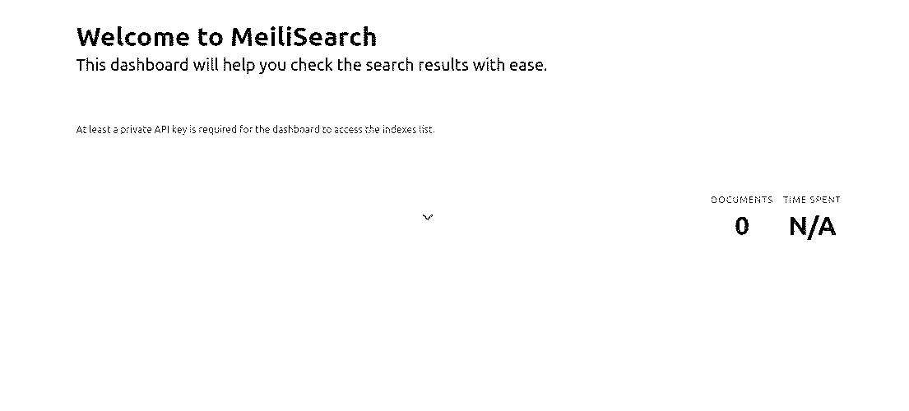
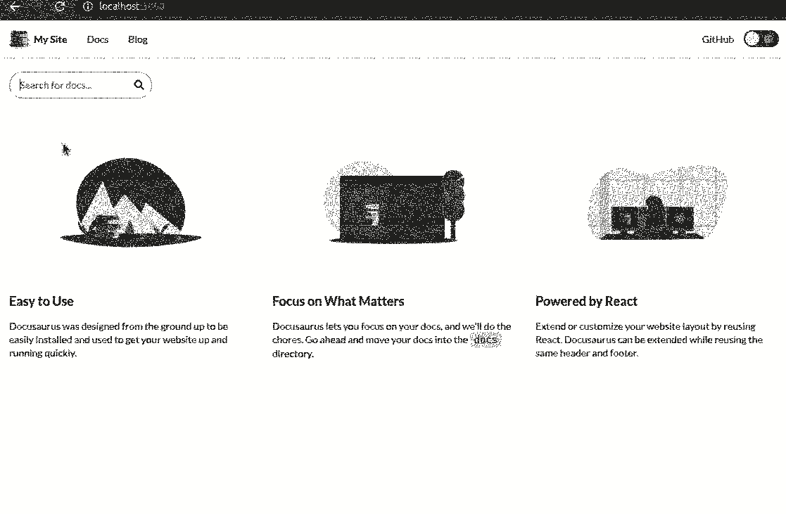

# Introduction

Cet article introduit une série d'articles qui viendront alimenter ce blog sur la thématique du software craftmanship. Quoi de mieux que Wikipédia pour définir ce concept?! 

> Le Software craftsmanship (ou l'« artisanat du logiciel ») est une approche de développement de logiciels qui met l'accent sur les compétences de codage des développeurs. Il se propose comme une réponse aux maux récurrents de l'industrie du logiciel et à la tendance à l'externalisation, qui priorise les préoccupations financières avant la responsabilité du développeur.
[https://fr.wikipedia.org/wiki/Software_craftsmanship](https://fr.wikipedia.org/wiki/Software_craftsmanship)

Ce qui me paraît essentiel avant d'assister à un cours ou d'appréhender de nouveaux concepts, c'est d'avoir les outils qui vous permettront de prendre des notes. Au même titre que vous aviez des stylos, des feuilles et des classeurs lors de vos études primaires pour organiser vos contenus, nous allons par analogie nous satisfaire de la [syntaxe Markdown](https://www.markdownguide.org/basic-syntax/) pour structurer nos notes (titre, sous-titre, liens...) et substituer nos classeurs par un moteur de recherche. 

L'outil avec lequel nous allons ranger nos notes se nomme Docusaurus. Docusaurus est une solution Open Source (MIT License) qui permet de déployer une documentation en HTML, la [versionner](https://fr.wikipedia.org/wiki/Gestion_de_versions)... Docusaurus permet de connecter nativement un moteur de recherche qui se nomme Algolia DocSearch, celui-ci fonctionne en explorant le contenu de votre site Web toutes les 24 heures en mettant tout le contenu dans un index Algolia. Ce contenu est ensuite interrogé directement depuis votre front-end à l'aide de l'API Algolia. Personnellement, je n'aime pas laisser trainer mes notes et données chez des tiers. C'est la raison pour laquelle je vous introduis MeiliSearch, une solution écrite en Rust:
> Un moteur de recherche open source, incroyablement rapide et hyper pertinent qui améliorera votre expérience de recherche.
 
L'avantage principal est l'aspect souverain de celui-ci, nous pouvons le déployer en local à côté de notre Docusaurus sans laisser fuiter nos notes, documentations chez un Notion.so ou une quelconque solution Wiki. Pour ce faire, j'ai développé un petit projet en 2h00 qui ne demande qu'à être amélioré, il me permet d'indexer des documents Docusaurus dans MeiliSearch.
Vous pouvez suivre les différentes étapes pour comprendre la solution technique ou bien directement récupérer le template sur Github: [https://github.com/clement-dev/-Blog-Docusaurus-x-MeiliSearch](https://github.com/clement-dev/-Blog-Docusaurus-x-MeiliSearch)

# Prérequis

* [Docker](https://www.docker.com/get-started)
* [Node & npm](https://nodejs.org/en/)

# Installation de Docusaurus
[https://v2.docusaurus.io/docs/installation](https://v2.docusaurus.io/docs/installation)
```bash
$ npx @docusaurus/init@next init notes classic
$ cd notes
$ npm run start
```
Vous devriez pouvoir accéder au site en local via l'URL [http://localhost:3000](http://localhost:3000)
Dans l'optique de simplifier la procédure de déploiement nous allons conteneuiser l'application grâce à Docker.
La finalité sera de démarrer Docusaurus et MeiliSearch simplement avec la commande `docker-compose up`.
Créons l'arborescence nécessaire.

**Arborescence**:
```
notes/
├── .docker/
│   ├── Dockerfile.dev
```
**Dockerfile.dev**
```docker
FROM node:lts
WORKDIR /app
COPY ./package*.json ./
RUN npm install
COPY . .
EXPOSE 3000
CMD [ "npm", "run", "start"]
```
Modifions le fichier package.json pour accéder au conteneur à partir de notre host.
```json
...
"start": "docusaurus start --host 0.0.0.0",
...
```
Nous venons créer le fichier docker-compose.yml. Pour l'instant il ne comporte que le service qui nous permettra de démarrer Docusaurus, mais dans la suite de ce tutoriel nous ajouterons le service MeiliSearch. 
Comme son nom l'indique docker compose vous permettra de composer vos services, vous pouvez voir vos images Docker comme des briques de Lego que vous allez pouvoir assembler entre-elles afin de façonner votre application. 
Je ne peux que vous encourager à aller voir la chaîne YouTube de Xavki qui vous sera très utile pour appréhender Docker.
[https://www.youtube.com/watch?v=pMAGe6nTkws](https://www.youtube.com/watch?v=pMAGe6nTkws)

**Arborescence**:
```
docker-compose.yml
notes/
├── .docker/
│   ├── Dockerfile.dev
```

**docker-compose.yml**
```docker
version: "3.7"

services:
  notes:
    build:
      context: ./notes
      dockerfile: .docker/Dockerfile.dev
    image: "clement/docusaurus:2.0.0-alpha.66"
    ports:
      - "0.0.0.0:3000:3000"
    volumes:
      - ./notes/src:/app/src
    networks:
      - docs-net

networks:
  docs-net:
```
En éteignant le précédent serveur qui fonctionne avec node, et en lançant la commande docker-compose up, vous devriez pouvoir
accéder de nouveau à l'URL http://localhost:3000

# Installation de MeiliSearch
Nous complétons le fichier docker-compose.yml pour y ajouter le service MeiliSearch.

**docker-compose.yml**
```docker
version: "3.7"

services:
  notes:
    build:
      context: ./notes
      dockerfile: .docker/Dockerfile.dev
    image: "clement/docusaurus:2.0.0-alpha.66"
		command: [ "npm", "run", "start:search"]
    ports:
      - "0.0.0.0:3000:3000"
    volumes:
      - ./notes/src:/app/src
    networks:
      - docs-net

  meilisearch:
    image: "getmeili/meilisearch:v0.16.0rc0"
    ports:
        - "0.0.0.0:7700:7700"
    volumes:
        - ./data-meilisearch:/data.ms
    networks:
        - docs-net
networks:
  docs-net:
```
Vous devriez pouvoir accéder à l'URL [http://localhost:7700](http://lcoalhost:7700) après avoir utilisé la commande `docker-compose up meilisearch` et voir l'interface suivante: 


# Lier MeiliSearch à Docusaurus

- Se rendre dans le dossier notes `cd notes`
- Installer axios: `npm i axios`
- Modifier le package.json pour lancer l'indexation au redémarrage de Docusaurus

**package.json**
```bash
"start:search": "node ./init-search.js && docusaurus start",
```
- Modifier le Dockerfile
**Dockerfile.dev**
```Docker
CMD [ "npm", "run", "start:search"]
```
Nous pouvons créer un fichier init-search.js à la racine du dossier notes qui va permettre de lancer l'indexation des documents au lancement du serveur.
```bash
notes/
├── init-search.js
```

**init-search.js**
```jsx
const glob = require("glob");
const fs = require("fs");
const axios = require('axios');

const NAME_OF_INDEX = 'docusaurus';

const processing = async () => {
    await glob(".docusaurus/docusaurus-plugin-content-docs/default/*.json", function(err, files) {
        if (err) {
            console.error("cannot read the folder, something goes wrong with glob", err);
        }

        const readFilesSync = (file) => {
            const ret = []
            ret.push(JSON.parse(fs.readFileSync(file, 'utf-8')))
            return ret
        }

        const updateIndex = async (docs) => {
            try {
                return await axios.post(`http://meilisearch:7700/indexes/${NAME_OF_INDEX}/documents`, docs);
            } catch (error) {
                console.error(error);
            }
        }
        files.forEach(function(file) {
            updateIndex(readFilesSync(file));
        });
    });
};

(async () => {
    await processing();
})();
```
# Composant Search pour Docusaurus

**Dépendances**
```bash
npm i semantic-ui-react
```

**Arborescence**
```bash
notes/
├── src/
│   ├── components/
│       ├── SearchBar
│           ├── style.css
│           ├── index.js

```

**index.js**
```jsx
import React, { useEffect, useState } from "react";
import { Search } from "semantic-ui-react";
import { Link } from "react-router-dom";

const styleLink = document.createElement("link");
styleLink.rel = "stylesheet";
styleLink.href = "https://cdn.jsdelivr.net/npm/semantic-ui/dist/semantic.min.css";
document.head.appendChild(styleLink);

async function fetchSearchEngine(query){
  const res = await fetch(`http://meilisearch:7700/indexes/docusaurus/search?q=${query}`);
  const docs = res.json();
  return docs;
}

function MySearch(props) {
  const [searchTerm, setSearchTerm] = useState("");
  const [docs, setDocs] = useState([]);

  useEffect(() => {
    if (searchTerm.length > 0) {
      fetchData(searchTerm);
    }
  }, [searchTerm]);

  async function fetchData(query) {
    console.log(query)
    const res = await fetchSearchEngine(query);
    const docs = res.hits  
    const docsInSearchResultForm = docs.map(doc => {
      return {
        key: doc.id,
        as: Link,
        to: `${doc.permalink}`,
        title: doc.title,
        description: doc.description,
      };
    });

    setDocs(docsInSearchResultForm);
  }

  function handleSearchChange(e, { value }) {
    setSearchTerm(value);
  }

  return (
    <Search
      placeholder={"Search for docs..."}
      onResultSelect={() => setSearchTerm("")}
      onSearchChange={handleSearchChange}
      results={docs}
      value={searchTerm}
    />
  );
}

export default MySearch;
```
**style.css**
```css
/**
 * Copyright (c) Facebook, Inc. and its affiliates.
 *
 * This source code is licensed under the MIT license found in the
 * LICENSE file in the root directory of this source tree.
 */

 :root {
    --docsearch-primary-color: var(--ifm-color-primary);
    --docsearch-text-color: var(--ifm-font-color-base);
  }
```
Modifions le fichier `./notes/src/pages/index.js` en ajoutant l'import:
```javascript
import SearchBar from '../components/SearchBar'
```
`./notes/src/css/custom.css`

**custom.css**
```css
.search{
  margin: 20px 0px;
}
```
`./notes/src/pages/index.js`

**index.js**
```jsx
<Layout
      title={`Hello from ${siteConfig.title}`}
      description="Description will go into a meta tag in <head />">
<div className="container">
                <div className="row">
                    <div className="col">
                        <SearchBar />
                    </div>
                </div>
            </div>
      <main>
```
# It Works !

